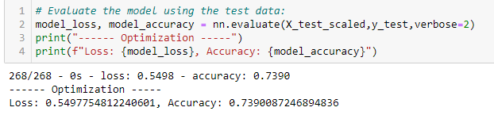
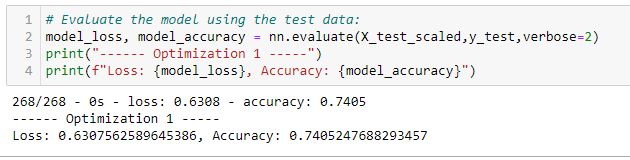
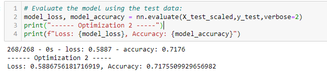
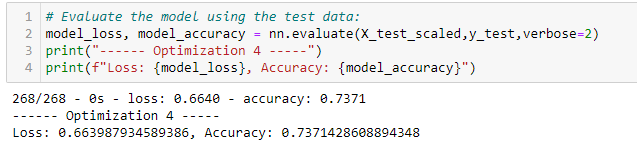

# Overview of Project:

Neural Network is a series of algorithms that endeavors to recognize underlying relationships in a set of data through a process that mimics the way the human brain operates. In this sense, neural networks refer to systems of neurons, either organic or artificial in nature.
Alphabet Soup’s a non-profit foundation dedicating to help organizations who protect environment, improve peoples well-being for a few examples. 
We have been tasked by them to analyse the impact of each donation, and their potential recipient to ensure that the money is being used effectively. 
Our problematic here is to predict which organizations are worst donating to and which are too high risk. 
To ensure a clear decisions making result, we decide to use a deep neural network machine learning algorithm for his ability to evaluate all types of input data.

# Results:

To achieve our result, we decompose our problem in 2 parts:
 
- Data preprocessing:
 
  - In our model the target variable is to known if the funding was successful, to determine if the money was used effectively.
  - Our features were all the other data columns included categorical variables after encoding.
  - We also removed from the input data the EIN and NAME columns as they are identification columns and have no influence on the result.
  
- Compiling, Training and Evaluating the model:
 
  - At first, we used to create the model with 43 features, 2 hidden layers because the larger the number of hidden layers in a neural network, the longer it will take for the neural network to produce the output, and the more complex problems the neural network can solve. We use in the first layer 80 neurons as a double of features involved and half of it (40) for the second layer.
  - With this model we were not able to achieve the target model performances (> 75% accuracy).
   
    
    
  - To increase or accuracy score we change couples parameters:
  
  1- Increase the numbers of features (70) as well as the number of hidden layers (4) and neurons (275 to start).
     
    
  2- Decrease the numbers of features (33).
     
    
  3- Adding more hidden layers (5) with a reduction of features (33).
     
    
  4- Change the output activation function and increase the number of epochs to the training regimen. 
     
    
    
# Summary:

The deep learning model predict the output at ~75% accuracy which is not bad but to decide if an organisation deserve funding and to reduce the risk of money lost for Alphabet's soup, we could use a logistic regression model because it's a statistical model that mathematically determines a probability of an output to belong to one or two groups which could be helpful because in our case we want to determine if a donation is successful or not. 